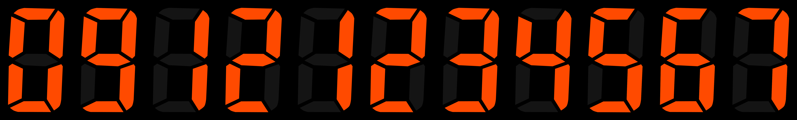

# DTMF Signal Decoder & Visualizer 📞

This project implements a **Dual-Tone Multi-Frequency (DTMF)** decoder using Digital Signal Processing (DSP) techniques in Python. It analyzes audio files (`.wav`) containing telephone dialing sounds, detects the dialed numbers, and reconstructs the number visually by concatenating digit images.

Developed as part of the **Signals and Systems** course at **Sharif University of Technology**.

## 🎯 Key Features
* **Standard DTMF Decoding:** Detects numbers with fixed duration and spacing.
* **Real-World Robustness (Bonus):** Successfully processes "Real Dialing" audio with **variable key-press duration** and **irregular silence intervals**.
* **Visual Reconstruction:** Generates a result image showing the dialed number sequence.
* **Noise Handling:** Implements silence thresholding to ignore background noise.

## 🛠 Algorithms & Techniques
Instead of using a simple FFT, this project utilizes a precise filter-bank approach:
1.  **Butterworth Bandpass Filters:** The signal is passed through a bank of bandpass filters centered around standard DTMF frequencies (Row: 697-941Hz, Col: 1209-1477Hz).
2.  **Energy Calculation:** The energy of the filtered signal is calculated to determine the dominant frequencies.
3.  **Digit Mapping:** The combination of the strongest Row and Column frequencies maps to the specific digit (0-9).

## 📊 Results
| Input Audio | Detected Sequence | Visual Output |
| :--- | :--- | :--- |
| `dialing1.wav` | **09121234567** |  |
| `realDialing1.wav` | **0912571830** |  |

---
*Tech Stack: Python, NumPy, SciPy (Signal Processing), Pillow (Image Processing)*
